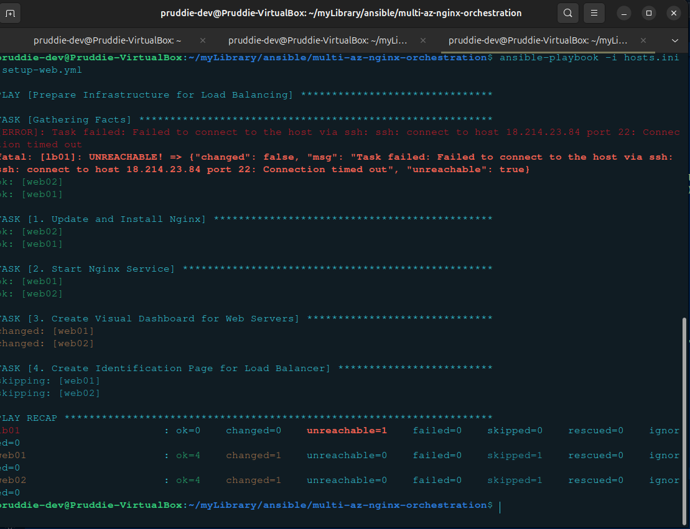
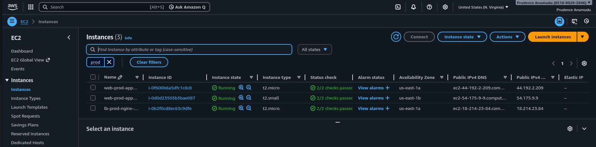

A high-availability web architecture deployed on AWS using Ansible for automated configuration management. This project demonstrates fault tolerance by distributing traffic across multiple Availability Zones.

## 🏗️ Architecture
- **Infrastructure:** Custom AWS VPC across 2 Availability Zones (AZs) for fault tolerance.
- **Load Balancer:** 1 Ubuntu EC2 instance running Nginx as a Reverse Proxy.
- **Web Tier:** 2 Ubuntu EC2 instances serving unique content to verify load distribution.
- **Automation:** Ansible playbooks for zero-touch deployment and configuration.

## 🚀 Key Features
- **High Availability:** Distributed nodes across multiple AZs to prevent single points of failure.
- **Security:** Layered Security Groups (LB accepts public HTTP/SSH; App Nodes are restricted to internal traffic).
- **Idempotent Automation:** Ansible logic ensures the environment stays in the desired state across all nodes.

## 🛠️ Tech Stack
- **Cloud:** AWS (EC2, VPC, IGW, Route Tables)
- **Configuration Management:** Ansible
- **Web Server:** Nginx (Reverse Proxy + Web)
- **OS:** Ubuntu 24.04 LTS

---

### 🔍 Verification & Traffic Distribution
The following screenshots demonstrate the Load Balancer successfully distributing traffic across both Availability Zones.

| App Server 01 (AZ: us-east-1a) | App Server 02 (AZ: us-east-1b) |
|---|---|
|  |  |

---

## 🛠️ Troubleshooting & Engineering Insights

### 1. The 504 Gateway Timeout (Connectivity "Wall")
**Issue:** After initial configuration, the Load Balancer returned a `504 Gateway Timeout`.
**Diagnosis:** Identified that while the LB was alive, it couldn't "see" the application nodes.
**Resolution:** Updated the Web Tier Security Group to allow Inbound HTTP traffic (Port 80) specifically from the Load Balancer's Security Group ID.

### 2. Ansible Connection Timeout (SSH Locking)
**Issue:** During the final UI deployment, the terminal reported `UNREACHABLE` for the Load Balancer node.
**Diagnosis:** My local ISP had rotated my Public IP, and the AWS Security Group was still configured to allow the old IP.
**Engineering Takeaway:** I chose to document this error rather than hide it. It highlights a successful security posture (Zero Trust) where unauthorized or unrecognized IPs are blocked by default.

---

## 📈 Future Game Plan
- **Project 3:** Implement real-time monitoring using **Prometheus and Grafana**.
- **Project 4:** Refactor the entire infrastructure using **Terraform** for full Infrastructure as Code (IaC).
