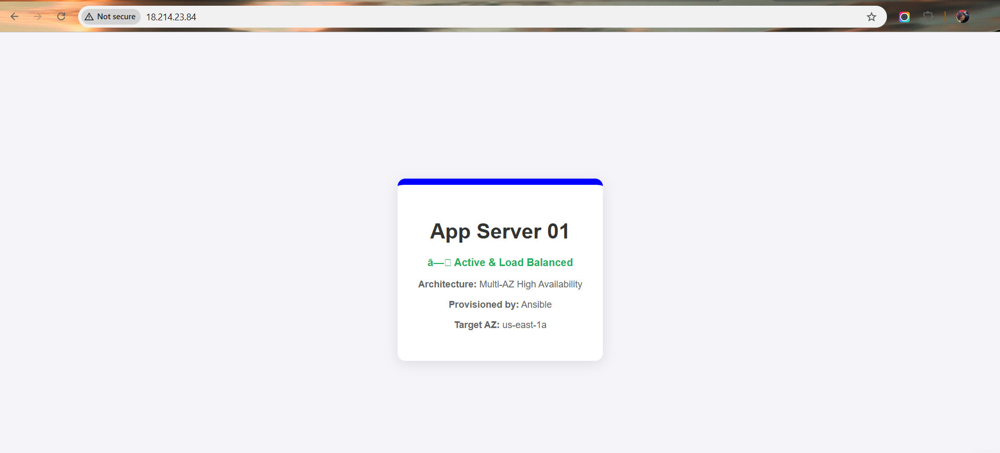
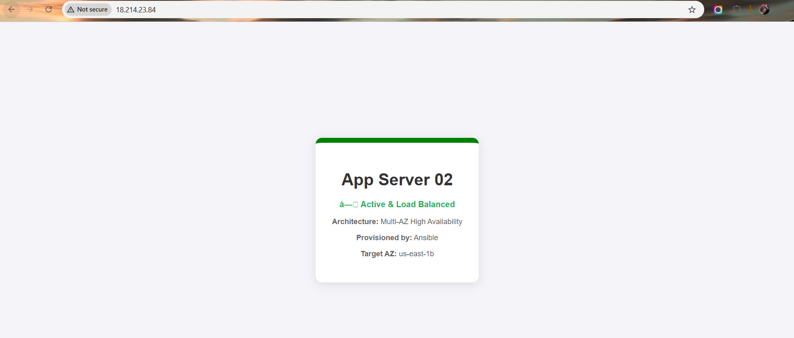

A high-availability web architecture deployed on AWS using Ansible for automated configuration management. This project demonstrates fault tolerance by distributing traffic across multiple Availability Zones.

## 🏗️ Architecture
- **Infrastructure:** Custom AWS VPC across 2 Availability Zones (AZs) for fault tolerance.
- **Load Balancer:** 1 Ubuntu EC2 instance running Nginx as a Reverse Proxy.
- **Web Tier:** 2 Ubuntu EC2 instances serving unique content to verify load distribution.
- **Automation:** Ansible playbooks for zero-touch deployment and configuration.

## 🚀 Key Features
- **High Availability:** Distributed nodes across multiple AZs to prevent single points of failure.
- **Security:** Layered Security Groups (LB accepts public HTTP/SSH; App Nodes are restricted to internal traffic).
- **Idempotent Automation:** Ansible logic ensures the environment stays in the desired state across all nodes.

## 🛠️ Tech Stack
- **Cloud:** AWS (EC2, VPC, IGW, Route Tables)
- **Configuration Management:** Ansible
- **Web Server:** Nginx (Reverse Proxy + Web)
- **OS:** Ubuntu 24.04 LTS

---

### 🌐 Load Balancer Verification
The following screenshots demonstrate the Nginx Load Balancer successfully distributing traffic across both Availability Zones.

| LB Request: Node 01 (AZ-1a) | LB Request: Node 02 (AZ-1b) |
|---|---|
|  |  |

---

### 🔍 Infrastructure Proof
Individual node verification ensures that each application server is healthy.

| App Server 01 (AZ: us-east-1a) | App Server 02 (AZ: us-east-1b) |
|---|---|
|  |  |

---

## 🛠️ Troubleshooting & Engineering Insights

### 1. The 504 Gateway Timeout (Connectivity "Wall")
**Issue:** Load Balancer returned a `504 Gateway Timeout`.
**Resolution:** Updated the Web Tier Security Group to allow Inbound HTTP traffic (Port 80) specifically from the Load Balancer's Security Group ID.

### 2. Ansible Connection Timeout (SSH Locking)
**Issue:** Terminal reported `UNREACHABLE` for the Load Balancer node.
**Engineering Takeaway:** Identified a rotated Public IP at the local level. Successfully demonstrated a "Zero Trust" security posture where unrecognized IPs are blocked.

---

## 📈 Future Game Plan
- **Project 3:** Implement real-time monitoring using **Prometheus and Grafana**.
- **Project 4:** Refactor the entire infrastructure using **Terraform**.
